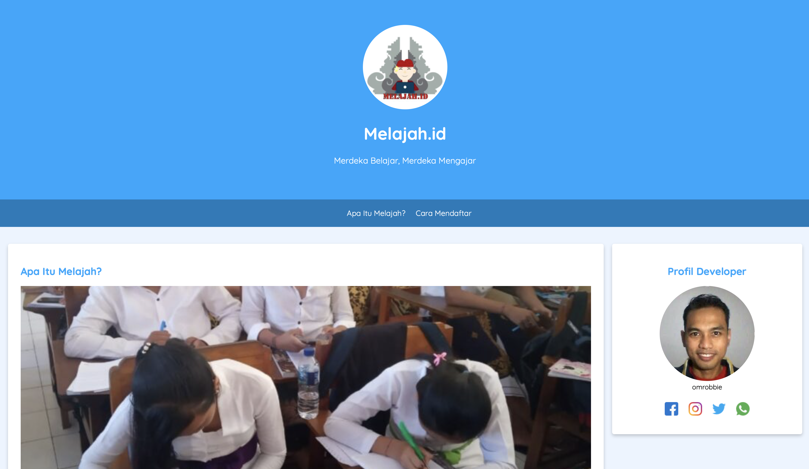
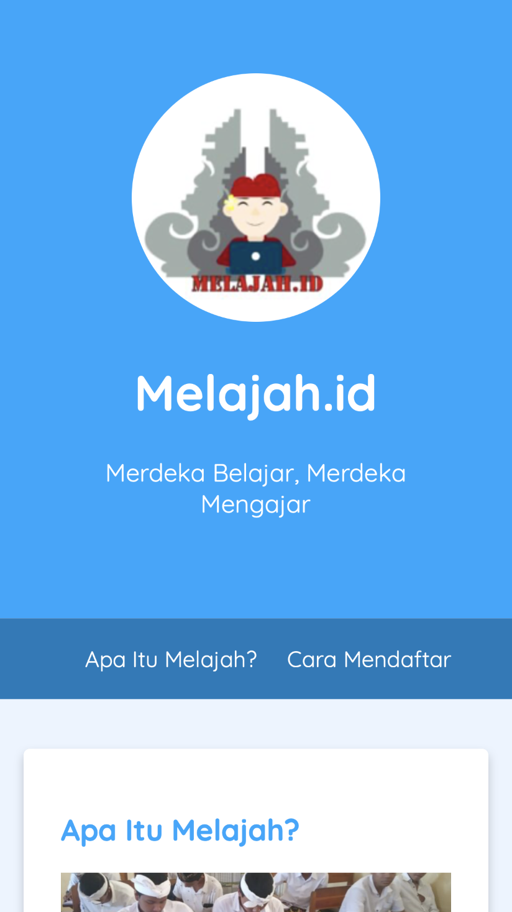

# [melajah.id](https://melajah.id)
Project ini adalah Submission dari materi [Belajar Dasar Pemrograman Web](https://www.dicoding.com/academies/123).

### Preview

## Submission
Untuk bisa lulus dan mendapatkan sertifikat dari akademi ini, Anda harus mengerjakan tugas Halaman Website sesuai kriteria lengkap di bawah. Tim reviewer akan memeriksa pekerjaan Anda dan memberikan review pada proyek yang Anda buat.

### Kriteria
#### Berikut kriteria submission yang harus Anda penuhi:

1. Terdapat elemen `<header>`, `<footer>`, `<main>`, `<article>` dan `<aside>`
2. Masing-masing elemen wajib berisi konten yang peruntukkannya sesuai dengan elemen tersebut (menerapkan konsep semantic HTML dalam menyusun struktur website)
3. Sebagai contoh: Header berisi judul dan navigation. Sedangkan konten artikel tidak boleh berada pada Header. Wajib menampilkan identitas diri (biodata diri) yang minimal harus berisi foto asli diri dan nama sesuai profil Dicoding. Identitas diri wajib ditampilkan dalam elemen `<aside>`
4. Menyusun layout dengan menggunakan float atau flexbox
5. Tema yang ditampilkan bebas, namun semakin detail dan lengkap website Anda maka nilai submission bisa lebih tinggi
  
#### Berikut sketsa dari struktur website yang bisa dijadikan referensi untuk mengerjakan submission, namun tidak diwajibkan asalkan memenuhi kriteria submission:

## Harap diperhatikan!
Bagi teman-teman yang masih mengikuti kelas dari dicoding, [Belajar Dasar Pemrograman Web](https://www.dicoding.com/academies/123). Silahkan gunakan source ini sebagai bahan referensi, tapi TIDAK untuk disalin secara utuh tanpa tau cara implementasinya.

Ayolah kawan.. Kalian sudah bayar mahal untuk ikut kelas ini, kalian harus dapat ilmunya. Percuma kalian dapat sertifikat dari dicoding kalau di kemudian hari kalian tidak mendapatkan ilmunya dari sini.

Semangat kawan.. Perjalanan masih panjang. Lakukan yang terbaik yang kalian bisa. Silahkan tanya saya jika ada yang kurang dimengerti. Kalau saya bisa bantu, pasti saya dampingi.

Mari kita maju bersama-sama..
